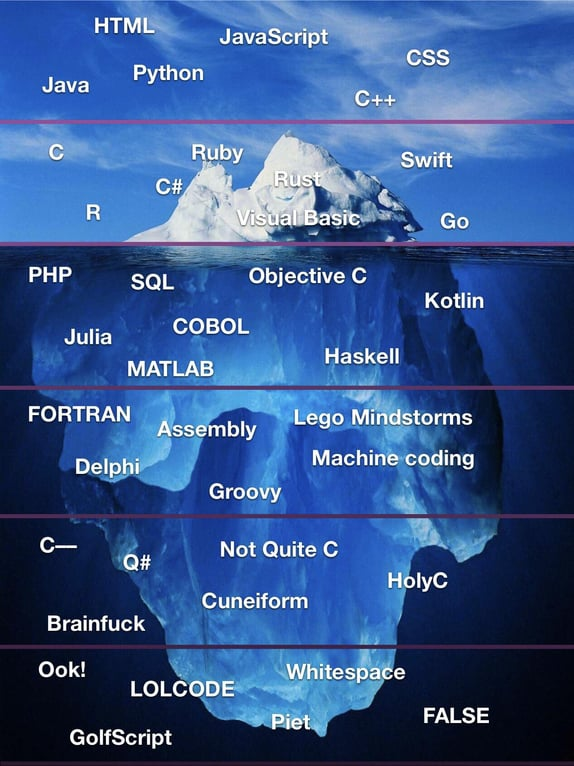
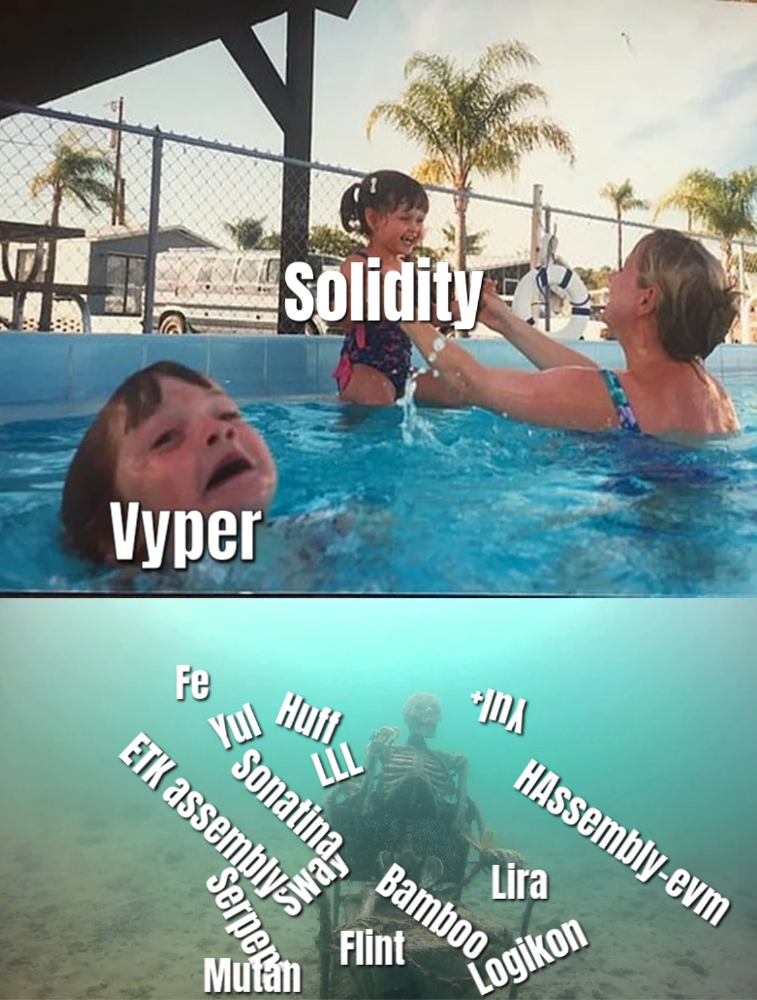

## Smart Contract languages of the EVM
### What else is there besides Solidity?
<br>
<br>
<br>
<br>
<br>
<br>

<div class=author-info>

**Kamil Śliwak** <br>
Code Poets / co-founder <br>
Ethereum Foundation / Solidity compiler team

</div>

----

#### EVM languages

<div class="column-container">
<div class="column r-stack">
<div class="fragment">

##### Expectation

 <!-- .element style="height: 85vh" -->

</div>
</div>

<div class="column r-stack">
<div class="fragment">

#### Reality

 <!-- .element style="height: 85vh" -->

</div>
</div>
</div>

----

## EVM languages
- Mainstream languages
- IR/assembly languages
- Experimental languages

---

## Mainstream languages
- Serpent
- Solidity
- Vyper
- Fe
- Sway

----

<div class=column-container>
<div class="column r-stack">

# Serpent

<div class="fragment card">

# Serpent
#### History
- 2014-2017
- by Vitalik Buterin
- used in Ethereum whitepaper
- originally called CLL (C-Like Language)

</div>

<div class="fragment card">

# Serpent
#### Characteristics
- relatively high-level
- procedural
- untyped
- pythonic

</div>
<div class="fragment card">

# Serpent
#### Highlights
- variables, expressions, control structures
- external functions
- constructors
- dynamic structures in storage
- static memory arrays

</div>
<div class="fragment card">

# Serpent
#### Drawbacks
- untyped variables
- no dynamic structures in memory
- no internal functions
- no imports
- unchecked arithmetic
- not much focus on security
- almost no documentation

</div>
</div>
<div class=column>

```python
def deposit():
    if not self.storage[msg.sender]:
        self.storage[msg.sender] = 0
    self.storage[msg.sender] += msg.value
    return(1)

def withdraw(amount):
    if self.storage[msg.sender] < amount:
        return(-1)
    else:
        self.storage[msg.sender] -= amount
        send(0, msg.sender, amount)
        return(1)

def transfer(amount, destination):
    if self.storage[msg.sender] < amount:
        return(-1)
    else:
        if not self.storage[destination]:
            self.storage[destination] = 0
        self.storage[msg.sender] -= amount
        self.storage[destination] += amount
        return(1)

def balance():
    if not self.storage[msg.sender]:
        return(-1)
    else:
        return(self.storage[msg.sender])
```

</div>
</div>

----

<div class=column-container>
<div class="column r-stack">

# Solidity

<div class="fragment card">

# Solidity
#### History
- 2014-now
- by Christian Reitwießner
- alternative compilers: Solang, SOLL

</div>
<div class="fragment card">

# Solidity
#### Characteristics
- high-level
- procedural
- strongly-typed
- curly-braced

</div>
<div class="fragment card">

# Solidity
#### Influences
- C++
- Python
- JavaScript

</div>
<div class="fragment card">

# Solidity
#### Highlights
- type safety
- object-oriented abstractions
- modifiers, events, errors
- inline assembly
- dynamic types
- versatility and flexibility
- very active development

</div>
<div class="fragment card">

# Solidity
#### Future
- generics and type system redesign
- compile-time evaluation
- debug data format

</div>
<div class="fragment card">

# Solidity
#### Drawbacks
- complexity
    - bad for auditability
    - bad for security
    - bad for formal analysis
- cost of abstractions
- stack pressure

</div>
</div>
<div class=column>

```solidity
// SPDX-License-Identifier: GPL-3.0
pragma solidity ^0.8.4;

contract Token {
    address public minter;
    mapping(address => uint) public balances;

    event Sent(address from, address to, uint amount);
    error Insufficient(uint requested, uint available);

    constructor() {
        minter = msg.sender;
    }

    function mint(address receiver, uint amount) public {
        require(msg.sender == minter);
        balances[receiver] += amount;
    }

    function send(address receiver, uint amount) public {
        if (amount > balances[msg.sender])
            revert Insufficient({
                requested: amount,
                available: balances[msg.sender]
            });

        balances[msg.sender] -= amount;
        balances[receiver] += amount;
        emit Sent(msg.sender, receiver, amount);
    }
}
```

</div>
</div>

----

<div class=column-container>
<div class="column r-stack">

# Vyper

<div class="fragment card">

# Vyper
#### History
- 2016-now
- by Vitalik Buterin
- successor to Serpent
- originally called Viper

</div>
<div class="fragment card">

# Vyper
#### Characteristics
- high-level
- procedural
- strongly-typed
- pythonic

</div>
<div class="fragment card">

# Vyper
#### Highlights
- sneks on the EVM
- addressing complexity by limiting features
    - no inheritance
    - no overloading
    - no modifiers
    - no imports
    - no inline assembly
- no unbounded computation and data structures
    - bounded dynamic arrays
    - no infinite loops
    - no recursive internal calls
- checked arithmetic early on
- static memory management
    - no "Stack too deep" errors

</div>
<div class="fragment card">

# Vyper
#### Memory expansion cost
- on the EVM you pay for memory space
    - based on highest address accessed (`MSIZE`)
    - cost quadratic over 704 bytes
    - see Yellow Paper for exact formula
- Solidity allocates but never frees memory
- Vyper allocates on internal call and frees afterwards

</div>
<div class="fragment card">

# Vyper
#### Drawbacks
- limiting, less flexibility
- static allocation can be wasteful
    - but often better than no deallocation
- cost of storing all variables in memory
- still had security issues despite limitations

</div>
</div>
<div class=column>

```vyper
beneficiary: public(address)
auctionStart: public(uint256)
auctionEnd: public(uint256)
highestBidder: public(address)
highestBid: public(uint256)
ended: public(bool)

@external
def __init__(
    _beneficiary: address,
    _auction_start: uint256,
    _bidding_time: uint256
):
    self.beneficiary = _beneficiary
    self.auctionStart = _auction_start
    self.auctionEnd = self.auctionStart + _bidding_time
    assert block.timestamp < self.auctionEnd

@external
@payable
def bid():
    assert block.timestamp >= self.auctionStart
    assert block.timestamp < self.auctionEnd
    assert msg.value > self.highestBid
    self.highestBidder = msg.sender
    self.highestBid = msg.value

@external
def endAuction():
    assert block.timestamp >= self.auctionEnd
    assert not self.ended
    self.ended = True
    send(self.beneficiary, self.highestBid)
```

</div>
</div>

----

<div class=column-container>
<div class="column r-stack">

# Fe

<div class="fragment card">

# Fe
#### History
- 2019-now
- by David Sanders
- originally called Rust Vyper
- started out as a Vyper compiler
- diverged into a separate language

</div>
<div class="fragment card">

# Fe
#### Characteristics
- high-level
- procedural
- strongly-typed
- Rust-like

</div>
<div class="fragment card">

# Fe
#### Influences
- Python
- Rust

</div>
<div class="fragment card">

# Fe
#### Highlights
- inherited from Vyper
    - no unbounded computation and data structures
    - no modifiers
    - no overloading
- moving towards Rust
    - `{` no more snek `}`
    - traits over inheritance
    - generics
    - module imports
    - lots of other good elements of the design
- influence from Solidity via Yul
    - dynamic memory management
    - variables on stack

</div>
<div class="fragment card">

# Fe
#### Drawbacks
- still in the alpha stage
- design in flux, pivoting from Python to Rust
- affected by stack pressure like Solidity

</div>
</div>
<div class=column>

```rust
struct Transfer {
    #indexed
    pub from: address
    pub value: u256
}
contract Token {
    _balances: Map<address, u256>

    pub fn __init__(mut self, mut ctx: Context) {
        self._balances[ctx.msg_sender()] = 1000_000_000
    }

    pub fn balanceOf(self, _ account: address) -> u256 {
        return self._balances[account]
    }

    pub fn transfer(
        mut self, mut ctx: Context,
        to: address, v: u256
    ) {
        self._transfer(ctx, from: ctx.msg_sender(), to, v)
    }

    fn _transfer(
        mut self, mut ctx: Context,
        from: address, to: address, v: u256
    ) {
        assert from != address(0) and to != address(0)
        self._balances[from] = self._balances[from] - v
        self._balances[to] = self._balances[to] + v
        ctx.emit(Transfer(from: from, v))
    }
}
```

</div>
</div>

----

<div class=column-container>
<div class="column r-stack">

# Sway

<div class="fragment card">

# Sway
#### History
- 2021-now
- by John Adler and Alex Hansen
- targets FuelVM
- EVM backend in development

</div>
<div class="fragment card">

# Sway
#### Characteristics
- high-level
- procedural
- strongly-typed
- Rust-like

</div>
<div class="fragment card">

# Sway
#### FuelVM vs EVM
- register-based
- very cheap memory
- memory shared between contract calls
- UTXO paradigm
- native assets
- scripts

</div>
<div class="fragment card">

# Sway
#### Highlights
- heap-based memory management
- language design closely following Rust
    - borrow-checker
    - generics
- inline assembly
- standard library
- no reentrancy issues
</div>
<div class="fragment card">

# Sway
#### Drawbacks
- on EVM may lose features that depend on FuelVM
    - reentrancy protection
    - no stack pressure
    - memory management
    - account abstraction
- more features = more complexity

</div>
</div>
<div class=column>

```rust
contract;

abi TestContract {
    #[storage(write)]
    fn initialize_counter(value: u64) -> u64;

    #[storage(read, write)]
    fn increment_counter(amount: u64) -> u64;
}

storage {
    counter: u64 = 0,
}

impl TestContract for Contract {
    #[storage(write)]
    fn initialize_counter(value: u64) -> u64 {
        storage.counter = value;
        value
    }

    #[storage(read, write)]
    fn increment_counter(amount: u64) -> u64 {
        let incremented = storage.counter + amount;
        storage.counter = incremented;
        incremented
    }
}
```

</div>
</div>

----

#### Mainstream languages: timeline


---

## IR/assembly languages
- LLL
- Yul
- Yul+
- ETK assembly
- Huff
- Sonatina

----

<div class=column-container>
<div class="column r-stack">

# LLL

<div class="fragment card">

# LLL
#### History
- 2014-now
- by Gavin Wood
- LLL = Lisp-Like Language
- LLL/Solidity deprecated
- LLL/Vyper lives on as Vyper IR

</div>
<div class="fragment card">

# LLL
#### Characteristics
- low-level
- imperative (not functional)
- untyped
- Lisp-inspired syntax

</div>
<div class="fragment card">

# LLL
#### Highlights
- S-expressions are extremely easy to parse
- variables, expressions, control structures
- direct stack manipulation possible
- imports
- inline assembly
- macros

</div>
<div class="fragment card">

# LLL
#### Drawbacks
- (to (is syntax weird) (is people (not (used-to Lisp))))
- not actually functional despite appearances
- not a perfect IR

</div>
</div>
<div class=column>

```lisp
(seq
    (def 'scratch 0x00)

    (def 'identity 0xac37eebb)

    (def 'function (function-hash code-body)
        (when
            (=
                (div
                    (calldataload 0x00)
                    (exp 2 224))
                function-hash)
            code-body))

    (returnlll
        (function identity
            (seq
                (mstore scratch (calldataload 0x04))
                (return scratch 32)))))
```

</div>
</div>

----

<div class=column-container>
<div class="column r-stack">

# Yul

<div class="fragment card">

# Yul
#### History
- 2017-now
- by Christian Reitwießner and Alex Beregszaszi
- JULIA -> IULIA -> Yul
- Solidity's inline assembly
- IR for Solidity, Fe, Flint, Logikon

</div>
<div class="fragment card">

# Yul
#### Characteristics
- low-level
- procedural
- untyped
- curly-braced
- designed primarily as IR

</div>
<div class="fragment card">

# Yul
#### Highlights
- very simple syntax
- human-readable by design
- control structures resembling those from Solidity
    - loops, conditions
    - variables
    - functions
- literals
- retains more high-level context for the optimizer

</div>
<div class="fragment card">

# Yul
#### Drawbacks
- no direct stack access
- no jumps
- no inline assembly
- no operators
- no imports
- no convenience features
- Yul->EVM transform is non-trivial and hides complexity

</div>
</div>
<div class=column>

```yul
object "C" {
    code {
        let size := datasize("C")
        datacopy(0, dataoffset("C_deployed"), size)
        return(0, size)
    }

    object "C_deployed" {
        code {
            function power(base, exponent) -> result {
                switch exponent
                case 0 { result := 1 }
                case 1 { result := base }
                default {
                    result := power(
                        mul(base, base),
                        div(exponent, 2)
                    )

                    switch mod(exponent, 2)
                    case 1 {
                        result := mul(base, result)
                    }
                }
            }

            mstore(0, power(2, 10))
            return(0, 0x20)
        }

        data ".metadata" "11223344"
    }
}
```

</div>
</div>

----

<div class=column-container>
<div class="column r-stack">

# Yul+

<div class="fragment card">

# Yul+
#### History
- 2020-2022
- by Nick Dodson

</div>
<div class="fragment card">

# Yul+
#### Characteristics
- low-level
- procedural
- untyped
- curly-braced

</div>
<div class="fragment card">

# Yul+
#### Highlights
- superset of Yul
- convenience features for humans
    - safe math
    - enums
    - constants
    - selector generation
    - memory structures

</div>
<div class="fragment card">

# Yul+
#### Drawbacks
- more complexity
    - not needed in an IR
    - more effort to parse and process
- not produced by the higher-level compilers

</div>
</div>
<div class=column>

```yul
object "SimpleStore" {
    code {
        let size := datasize("Runtime")
        datacopy(0, dataoffset("Runtime"), size)
        return(0, size)
    }

    object "Runtime" {
        code {
            calldatacopy(0, 0, 36)
            mstruct StoreCalldata(sig: 4, val: 32)

            let topic := topic"event Store(uint256 value)"

            switch StoreCalldata.sig(0)
            case sig"function store(uint256 val)" {
                sstore(0, StoreCalldata.val(0))
                log2(0, 0, topic, StoreCalldata.val(0))
            }
            case sig"function get() returns (uint256)" {
                mstore(100, sload(0))
                return (100, 32)
            }
        }
    }
}
```

</div>
</div>

----

<div class=column-container>
<div class="column r-stack">

# ETK assembly

<div class="fragment card">

# ETK assembly
#### History
- 2021-now
- by Matt Garnett and Sam Wilson
- ETK = EVM ToolKit.
- inspired by NASM and similar assemblers
- still experimental

</div>
<div class="fragment card">

# ETK assembly
#### Characteristics
- low-level
- imperative
- untyped
- assembly
- designed primarily for humans

</div>
<div class="fragment card">

# ETK assembly
#### Highlights
- designed for creating EVM bytecode by hand
    - direct stack access
    - jumps
    - nothing is hidden from the programmer
- minimal convenience features for humans
    - macros
    - operators
    - selector generation
    - imports
- close to EVM assembly output from higher-level compilers

</div>
<div class="fragment card">

# ETK assembly
#### Drawbacks
- nothing is hidden from the programmer
- harder to read and analyze than Yul
- not an IR so not produced by the higher-level compilers

</div>
</div>
<div class=column>

```
%macro foo()
    push1 start
    jump
%end

%macro bar()
    start:
    push1 0x40
    push1 start
%end

%macro foobar(tag, gat)
    push2 $tag
    push2 $gat
    push1 delayed_expr(7)
%end

%def delayed_expr(x)
    $x + 1
%end

start:
    jumpdest
    pc
    %foo()
    %bar()
    push1 delayed

delayed:
    %foobar(start, 0x42)
```

</div>
</div>

----

<div class=column-container>
<div class="column r-stack">

# Huff

<div class="fragment card">

# Huff
#### History
- 2019-now
- by Zachary Williamson
- initial implementation in JavaScript
- In 2022 reimplemented in Rust

</div>
<div class="fragment card">

# Huff
#### Characteristics
- low-level
- imperative
- untyped
- assembly
- designed primarily for humans

</div>
<div class="fragment card">

# Huff
#### Features
- designed for creating EVM bytecode by hand
    - direct stack access
    - jumps
- extra convenience features over ETK
    - constants
    - custom errors
- higher level primitives
    - jump tables
    - functions

</div>
<div class="fragment card">

# Huff
#### Drawbacks
- a little more complexity than in ETK
- missing some convenience features from ETK
    - operators
- harder to read and analyze than Yul
- not an IR so not produced by the higher-level compilers

</div>
</div>
<div class=column>

```
#define function addWord(uint256) pure returns (uint256)
#define constant OWNER = FREE_STORAGE_POINTER()

#define macro ONLY_OWNER() = takes (0) returns (0) {
    caller
    [OWNER] sload
    eq
    is_owner jumpi
    0x00 0x00 revert

    is_owner:
}

#define macro ADD_WORD() = takes (1) returns (1) {
    ONLY_OWNER()
    0x20
    add
}

#define macro MAIN() = takes (0) returns (0) {
    0x00 calldataload
    0xE0 shr
    __FUNC_SIG(addWord)
    eq
    add_word jumpi
    0x00 0x00 revert

    add_word:
        0x04 calldataload
        ADD_WORD()
        0x00 mstore
        0x20 0x00 return
}
```

</div>
</div>

----

<div class=column-container>
<div class="column r-stack">

# Sonatina

<div class="fragment card">

# Sonatina
#### History
- 2021-now
- by Yoshitomo Nakanishi
- meant to replace Yul as Fe's IR
- still very experimental

</div>
<div class="fragment card">

# Sonatina
#### Characteristics
- low-level
- imperative
- weakly-typed
- assembly-like
- designed primarily as IR

</div>
<div class="fragment card">

# Sonatina
#### Highlights
- simple syntax
- types
- more friendly towards some code generation strategies
    - explicit jumps instead of control structures
    - no direct stack access
    - variables and functions

</div>
<div class="fragment card">

# Sonatina
#### Drawbacks
- not as readable as Yul
- design still in flux, not much documentation

</div>
</div>
<div class=column>

```
target = "evm-ethereum-london"

func public %nested_loops(v0.i32, v1.i32) -> void:
    block0:
        jump block1;

    block1:
        v2.i32 = phi (0.i32 block0) (v9 block5);
        jump block2;

    block2:
        v3.i32 = phi (0.i32 block1) (v7 block3);
        jump block3;

    block3:
        v4.i32 = add v0 v2;
        v5.i32 = add v0 v1;
        v6.i32 = mul v4 v5;
        v7.i32 = sub v6 v3;
        v8.i1 = slt v7 10.i32;
        br v8 block4 block2;

    block4:
        v9.i32 = add v2 1.i32;
        v10.i1 = slt v9 100.i32;
        br v10 block1 block5;

    block5:
        return;
```

</div>
</div>

----

#### IR/assembly languages: timeline


---

## Experimental languages

| Language       | Influences       | Style              |
|----------------|------------------|--------------------|
| Mutan          | Go, C            | procedural         |
| Bamboo         | Obsidian, Erlang | procedural         |
| Flint          | Swift            | procedural         |
| Pyramid Scheme | Scheme           | functional         |
| HAssembly-evm  | Haskell          | functional         |
| Logikon        | Prolog, Haskell  | logical/functional |
| Lira           |                  | declarative        |

----

#### Experimental languages: timeline


---

# What else is there?

----

### ZK/circuit languages


----

### Languages on other blockchains


---

# Thank you!

<br>
<br>
<br>
<br>

<div style="text-align: left">

- ✉ kamil.sliwak@codepoets.it<br>
- **@cameel**
- `#solidity-dev` channel on Matrix

</div>
