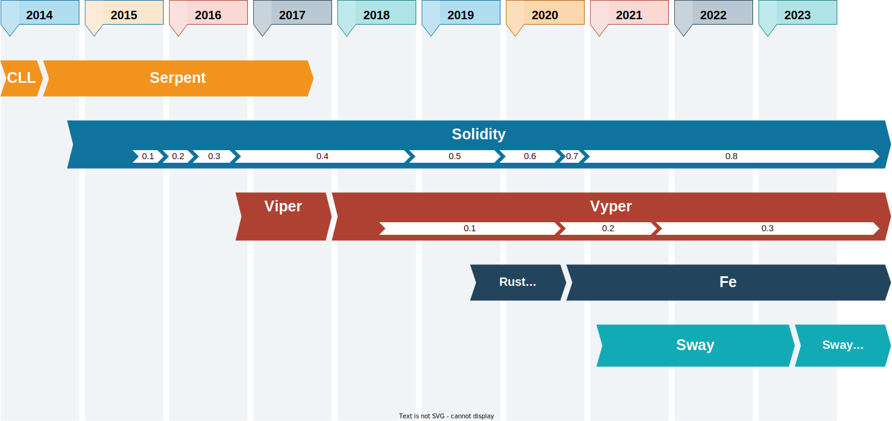
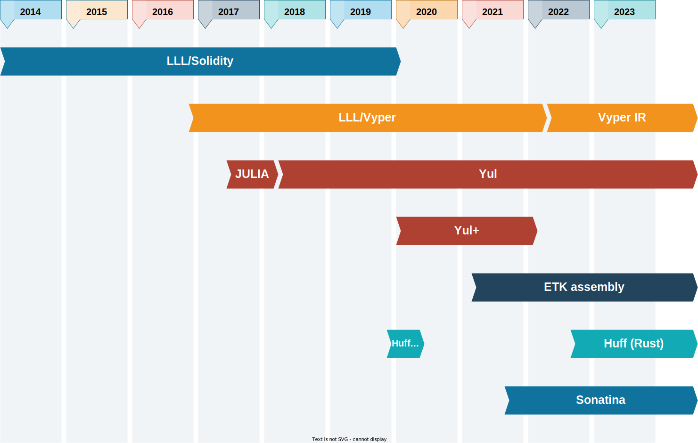
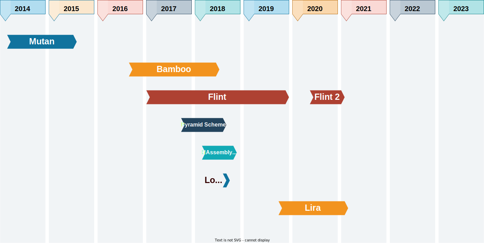

## Introduction

## Groups of EVM languages
- Mainstream high-level languages
- IR/assembly
- Experimental languages

---

## Mainstream languages
- Solidity
- Serpent
- Vyper
- Fe
- Sway

---

## Solidity
<table><tr><td>

- 2014-now, by Christian Reitwießner
- high-level, procedural, strongly-typed, curly-bracket
- influenced by C++, Python, JavaScript
- notable features:
    - object oriented
    - mappings
    - events
    - modifiers
    - dynamic memory allocation
    - inline assembly

</td><td>

`helloworld.sol`:
```solidity
// SPDX-License-Identifier: MIT
pragma solidity >=0.6.0 <0.9.0;

contract HelloWorld {
    function helloWorld()
        external
        pure
        returns (string memory)
    {
        return "Hello, World!";
    }
}
```

</td></tr></table>

## Serpent
<table><tr><td>

- 2014-2017, by Vitalik Buterin
- used in Ethereum whitepaper
- low-level, procedural, weakly-typed, pythonic
- notable features:
    - variables, conditions, loops
    - functions (external only)
- limitations
    - untyped variables
    - no imports

</td><td>

`subcurrency.se`:
```python
def init():
    self.storage[msg.sender] = 1000000

def balance_query(k):
    return(self.storage[addr])

def send(to, value):
    fromvalue = self.storage[msg.sender]
    if fromvalue >= value:
        self.storage[from] = fromvalue - value
        self.storage[to] += value
```

</td></tr></table>

## Vyper
<table><tr><td>

- 2016-now, by Vitalik Buterin
- originally called Viper, successor to Serpent
- high-level, procedural, strongly-typed, pythonic
- notable features:
    - intentionally small and limiting
    - bounds on everything
    - contracts, functions, events
    - static memory management
        - no "Stack too deep" errors
- limitations
    - no recursive calls
    - no inheritance, no overloading, no modifiers
    - no imports
    - no inline assembly

</td><td>

`contract.vy`:
```vyper
# @version ^0.3.0

paid: HashMap[address, bool]

@external
@payable
def pay():
    assert msg.value > 0
    self.paid[msg.sender] = True

@external
@nonpayable
def reset(user: address):
    if self.isPaid():
        self.paid[user] = False

@internal
@view
def isPaid() -> bool:
    return self.paid[msg.sender]
```

</td></tr></table>

## Fe
<table><tr><td>

- 2019-now, by David Sanders
- originally called Rust Vyper
- started as a Vyper compiler
- diverged into a separate language
- high-level, procedural, strongly-typed, Rust-like
- Influenced by Python and Rust.
- notable features:
    - bounds on everything
    - contracts, functions, events
    - imports
    - standard library
    - generics
    - dynamic memory allocation
- limitations
    - no inheritance, no overloading, no modifiers
    - no inline assembly

</td><td>

`contract.fe`:
```rust
struct Signed {
    book_msg: String<100>
}

contract GuestBook {
    messages: Map<address, String<100>>

    pub fn sign(
        self,
        ctx: Context,
        book_msg: String<100>
    )
    {
        self.messages[ctx.msg_sender()] = book_msg
        ctx.emit(Signed(book_msg: book_msg))
    }

    pub fn get_msg(
        self,
        addr: address
    ) -> String<100>
    {
        return self.messages[addr].to_mem()
    }
}
```

</td></tr></table>

## Sway
<table><tr><td>

- 2021-now, by John Adler and Alex Hansen
- high-level, procedural, strongly-typed, Rust-like
- targets FuelVM
- as of March 2023 EVM backend is in development
- notable features:
    - libraries
    - mappings, structs, tuples, enums
    - generics
    - proper memory management
    - borrow-checker
    - inline assembly
    - standard library

</td><td>

`counter.sw`:
```rust
contract;

abi TestContract {
    #[storage(write)]
    fn initialize_counter(value: u64) -> u64;

    #[storage(read, write)]
    fn increment_counter(amount: u64) -> u64;
}

storage {
    counter: u64 = 0,
}

impl TestContract for Contract {
    #[storage(write)]
    fn initialize_counter(value: u64) -> u64 {
        storage.counter = value;
        value
    }

    #[storage(read, write)]
    fn increment_counter(amount: u64) -> u64 {
        let incremented = storage.counter + amount;
        storage.counter = incremented;
        incremented
    }
}
```

</td></tr></table>

## Mainstream languages: influences

---

## Mainstream languages: timeline



## IR/assembly languages
- LLL/Vyper IR
- Yul
- Yul+
- ETK assembly
- Huff
- Sonatina

## LLL/Vyper IR
<table><tr><td>

- 2014-now, by Gavin Wood
- LLL = Lisp-Like Language
- LLL/Solidity deprecated
- LLL/Vyper lives on as Vyper IR
- low-level, imperative, untyped, Lisp-like

</td><td>

`creation.lll`:
```lisp
{
    ;; Initialisation code goes here
    [[0]] (caller)

    ;; Return the contract code
    (return 0 (lll {
        ;; Contract code goes here
        (when
            (= (caller) @@0)
            (suicide (caller))
        )
    } 0))
}
```

</td></tr></table>

## Yul
<table><tr><td>

- 2017-now, by Christian Reitwießner and Alex Beregszaszi
- JULIA -> IULIA -> Yul
- low-level, procedural, untyped, curly-bracket

</td><td>

`object.yul`:
```yul
object "C" {
    code {
        let size := datasize("C")
        datacopy(0, dataoffset("C_deployed"), size)
        return(0, size)
    }

    data "Tag" hex"4123"

    object "C_deployed" {
        code {
            mstore(0x40, 0x80)
        }

        object "B" {
            code {
                let o := dataoffset("other")
                sstore(0, o)
            }
            data ".metadata" "M1"
            data "other" "Hello, World2!"
        }

        data ".metadata" "11223344"
    }
}
```

</td></tr></table>

## Yul+
<table><tr><td>

- 2020-2022, by Nick Dodson
- low-level, procedural, untyped, curly-bracket

</td><td>

`simple-store.yulp`:
```yul
object "SimpleStore" {
    code {
        datacopy(0, dataoffset("Runtime"), datasize("Runtime"))
        return(0, datasize("Runtime"))
    }

    object "Runtime" {
        code {
            calldatacopy(0, 0, 36)

            mstruct StoreCalldata(
                sig: 4,
                val: 32
            )

            switch StoreCalldata.sig(0)

            case sig"function store(uint256 val)" {
                sstore(0, StoreCalldata.val(0))
                log2(
                    0,
                    0,
                    topic"event Store(uint256 value)",
                    StoreCalldata.val(0)
                )
            }

            case sig"function get() returns (uint256)" {
                mstore(100, sload(0))
                return (100, 32)
            }
        }
    }
}
```

</td></tr></table>

## ETK assembly
<table><tr><td>

- 2021-now, by lightclient and Sam Wilson
- low-level, imperative, untyped, assembly-like
- inspired by NASM and similar assemblers

</td><td>

`contract.etk`:
```asm
push1 0x00

loop:
    jumpdest
    push1 0x01
    add
    dup1
    push1 0xFF
    gt
    push1 loop
    jumpi

pop
stop
```

</td></tr></table>

## Huff
<table><tr><td>

- 2019-now, by Zachary Williamson
- low-level, imperative, untyped, assembly-like

</td><td>

`jumps.huff`:
```asm
#define macro MAIN() = takes (0) returns (0) {
    0x48656c6c6f2c20576f726c6421
    0x00 mstore

    success
    jump

    0x00 0x00 revert

    success:
        0x00 mstore
        0x20 0x00 return
}
```

</td></tr></table>

## Sonatina
<table><tr><td>

- 2021-now, by Yoshitomo Nakanishi
- low-level, imperative, strongly-typed, assembly-like

</td><td>

`jumps.sntn`:
```
target = "evm-ethereum-london"

func public %basic(v0.i32, v1.i32) -> void:
    block0:
        fallthrough block1;

    block1:
        v2.i32 = phi (0.i32 block0) (v4 block2);
        v3.i32 = add v0 v1;
        jump block2;

    block2:
        v4.i32 = add v2 v3;
        v5.i1 = slt v2 10.i32;
        br v5 block1 block3;

    block3:
       return;
```

</td></tr></table>

## IR/assembly languages: influences

---

## IR/assembly languages: timeline



## Experimental languages: influences

| Language       | Influences       | Style              |
|----------------|------------------|--------------------|
| Mutan          | Go, C            | procedural         |
| Bamboo         | Obsidian, Erlang | procedural         |
| Flint          | Swift            | procedural         |
| Pyramid Scheme | Scheme           | functional         |
| HAssembly-evm  | Haskell          | functional         |
| Logikon        | Prolog, Haskell  | logical/functional |
| Lira           |                  | declarative        |

## Experimental languages: timeline



## Other languages
- L2 languages
- ZK/circuit languages
- Languages on other blockchains

---

## Endcard
