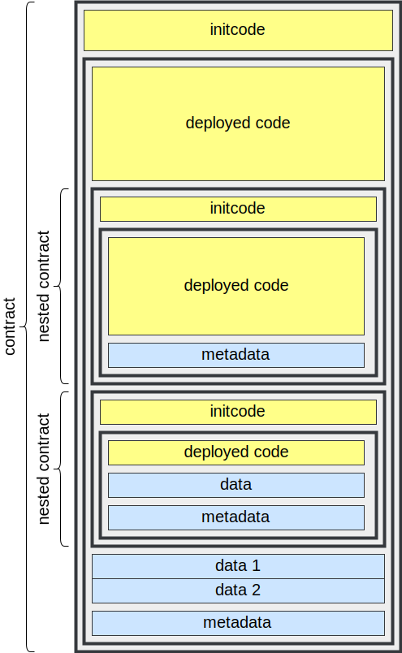

## What's holding back better smart contract languages and tools on Ethereum?
<br>
<br>
<br>
<br>
<br>
<br>

<div class=author-info>

**Kamil Śliwak** <br>
Code Poets / co-founder <br>
Ethereum Foundation / Solidity compiler team co-lead

</div>

----

## What is EVM?
- Ethereum Virtual Machine
- Target architecture for compilation of smart contracts.

----

## Solidity vs Yul vs EVM

----

## Tools

<div class="r-stack">
<div class="fragment card">
<div class=column-container>
<div class="column">

### Static analysis
- Compilation
- Optimization
- Transpilation
- Decompilation
- Vulnerability detection
- Equivalence checking
- Symbolic execution

</div>
<div class=column>

### Dynamic analysis
- Execution
- Debugging
- Profiling
- Monitoring

</div>
</div>
</div>

<div class="fragment card">

Writing static analysis tools for the EVM is harder than it should!

</div>

<div class="fragment card">

### Result
- Language monoculture
- Slow development
- Unreliable results
- Some tools just do not exist

</div>
</div>

----

## Drawbacks of the EVM
- Limited stack
- Unstructured bytecode
- Dynamic jumps
- Code introspection
- Gas introspection
- No versioning

---

## Limited stack

----

### EVM stack limitations
- Stack machine - no registers
- Local stack: up to 1024 256-bit words, but only the top 16 accessible at any given time
    - No stack frames
    - No memory pages
    - Memory is expensive (non-linear cost)
- Call stack: up to 1024 frames
    - Only for external calls (very expensive; cold `CALL` costs 2600 gas vs 8 gas for `JUMP`)
    - Expensive arguments (ABI-encoded; passed in calldata)

----

### Function calls in Solidity
- External function calls use the call stack
- Internal function calls use the local stack
    - Local variables
    - Parameters and return values
    - Return addresses

----


### "Stack Too Deep" error

```bash
solc too-many-arguments-stack-too-deep.sol --bin
```

```solidity
contract C {
    function f(
        uint, uint, uint, uint,
        uint, uint, uint, uint,
        uint, uint, uint, uint,
        uint, uint, uint, uint, uint
    ) internal
    {}

    function run() external {
        f(
             1,  2,  3,  4,
             5,  6,  7,  8,
             9, 10, 11, 12,
            13, 14, 15, 16, 17
        );
    }
}
```

```
Error: Stack too deep. (...)
```

----

### Does optimizer help?
- Tension between some optimization steps
    - Pruning unused variables reduces stack pressure
    - Inlining functions introduces more local variables
        - This prevents us from inlining more - jumps on the EVM are expensive
- In the IR pipeline (`--via-ir`) it helps more
    - Can prune unused paramters
    - Enables more advanced optimization

----

### Optimal stack scheduling
- Stack compressor: aggressive rematerialization of variables to free stack slots

    <div class=column-container>
    <div class="column">

    ```yul
    let a := 1
    let b := 2
    f(a, b)
    ```

    </div>
    <div class="column">

    ```yul


    f(1, 2)
    ```

    </div>
    </div>

- Stack layout generation based on the control flow graph
- Project GreY: *Greedy algorithm for Yul to EVM*
    - Collaboration with the researchers from the University of Madrid

----

### Spilling to memory
- Moves variables that are out of reach from stack to memory
- Has limitations:
    - Requires `memory-safe` assembly
    - Does not support recursive functions
- Our implementation is still imperfect. Local changes can affect global layout.

----

### Spilling to memory (example)
```bash
solc memory-mover.sol --optimize --ir-optimized --debug-info none
```
Generated IR:
```yul
...

object "C_46_deployed" {
    code {
        {
            let _1 := memoryguard(0xa0)  // Area between 0x80 and 0xA0 was reserved for moved variables
            mstore(64, _1)
            if iszero(lt(calldatasize(), 4))

...
```

----

### Stack access limit is artificial
- Why 16 slots?
    - Limited opcode space: 256 possible single-byte values
    - Each exposed stack slot received a dedicated `DUPn` and `SWAPn` opcode: 32 in total.
- EIP-663: SWAPN, DUPN and EXCHANGE instructions
    - Proposal that would expose 256 top slots. Would save a lot of engineering effort with no real downsides.

----

### How does Vyper solve it?
- In the past: always use external calls
- Newer memory model: local variables and parameters in memory, at fixed locations. Only return address on the stack.
- Disadvantages:
    - Limited language expressivity
        - No recursion; not an attractive option e.g. for a functional language
        - Fixed maximum size for arrays to keep locations fixed
    - More expensive
        - Moving values to/from memory for every operation
        - Non-linear memory expansion cost
        - Worst-case size always allocated for arrays
- Future: Venom IR
    - The opposite of spilling to memory - moving selected variables to the stack

---

## Unstructured bytecode

----

<div class=column-container>
<div class="column">

### What's inside a compiled Solidity contract?
- Code
    - Functions
- Nested contracts (*subassemblies*)
- Data blobs
- Metadata

</div>
<div class="column">




</div>
</div>

----

### Do you remember GOTO?


- Used to be common in high-level languages: BASIC, Fortran, Pascal, C, even C++.
    ```basic
    OK
    10 PRINT "HELLO!"
    20 GOTO 10
    ```
- Newer languages tend to eschew it
- Safer constructs for breaking out of the control flow:
    - Multi-level break
    - Exceptions
- GOTO (jumps) is pretty much all we have we have
- This is pretty much GOTO

----

### Control flow at the Solidity level

<div class=column-container>
<div class="column">

- Internal function calls
- Loops
- Conditions
- External function calls
- Contract creation

</div>
<div class="column">

```solidity
contract C {
    uint[] x;

    function g() internal {
        for (uint i = 0; i < 10; ++i) {
            x.push();
            if (i % 5 == 0)
                break;
        }
    }

    function f() external {
        g();
    }
}
```

</div>
</div>

----

### Control flow at the EVM level

<div class=column-container>
<div class="column">

- `JUMP`/`JUMPI`
- `CALL`/`STATICCALL`/`DELEGATECALL`
- `CREATE`/`CREATE2`

```bash
solc control-flow.sol --asm
```

</div>
<div class="column full-page">

```
tag_3:  // external f()
  tag_4                    // return label: end of contract
  jump(tag_5)              // in -> g()

tag_4:  // end of contract
  stop

tag_5:  // g()
  push0
  ...

tag_7:  // for loop
  iszero(lt(dup2, 10))
  jumpi(tag_8)             // -> after for loop
  ...                      // x.push()
  push0
  push1 2
  dup3
  tag_11                   // return label: if
  ...
  jump(tag_12)             // in -> utility function

tag_11: // if (i % 2 == 0)
  sub
  iszero
  jumpi(tag_8)             // break -> after for loop
  dup1
  0x01
  add
  swap1
  pop
  jump(tag_7)              // -> for loop condition

tag_8:  // after for loop
  pop
  jump                     // out -> f()
```

</div>
</div>

----

### How does EVM see a compiled contract?
- Unstructured sequence of opcodes
    - No container format. Internal structure, if any, is just a convention
    - No validation: anything can be deployed, invalid opcodes fail when executed
    - No functions: every kind of control flow is a jump

----

### Comparison with other architectures
- JVM: classes, functions, jumps
- WASM: function calls, loops, conditions, no jumps
- x86: function calls, loops, jumps

----

### Structure introduced by EOF
[EVM Object Format](https://evmobjectformat.org)
- Container format with a proper header
- Code sections (functions)
    - Introduces a separate return stack
- Nested containers
- Data section
- Metadata section

----

### Result: unreliable decompilation

```
solc bytecode-structure.sol --bin --output-dir .

heimdall disassemble Owner.bin --output print
heimdall decompile Owner.bin-runtime --include-yul --output print
heimdall cfg Owner.bin-runtime --output print
```

- Impossible to reliably distinguish code and data
    - A dynamic jump could even jump into data and start executing it
- Hard to distinguish nested contracts
    - Source verification services like Sourcify use heuristics
- Internal function detection relies on heuristics
    - Annotating jumps in/out of functions in solc output articacts was highly requested by debugger authors
    - After conversion to bytecode they are hard to recover, especially after optimization.

---

## Code introspection

----

### Contract creation on Ethereum is dynamic
- Deployer submits a blob of bytecode (initcode) that will run once and generate the actual code
    - Compilers typically limit this flexibility: user-supplied code from the constructor runs as initcode, but does not produce the contract
    - What gets deployed is the result of compilation of of the contract
- Immutables: constants injected into the deployed bytecode at creation time
    - Constant, but not necessarily known at compilation time
- In a general case the final bytecode that ends up on chain may be unknown ahead of time
    - May depend on the input or blochain state (including result of external calls)

----

### Example: contract with an immutable
```bash
solc immutable.sol --ir --debug-info none
```
```yul
...
constructor_C_5()

let _1 := allocate_unbounded()
codecopy(_1, dataoffset("C_5_deployed"), datasize("C_5_deployed"))
setimmutable(_1, "4", mload(128))
return(_1, datasize("C_5_deployed"))
...
```

----

### Transpilation / binary translation
Conversion of compiled bytecode to another architecture.
- x86
- zkEVM
- RISC-V
----

### Transpilation vs dynamic code generation
- Code generated at runtime cannot be transpiled ahead of time. It requires a JIT approach.

----

### Introspection ban on EOF
- Explicit subcontainer structure
- Only code from subcontainers can be deployed (without modification)
- Data supplied separately
    - Immutables passed in ato `RETURNCONTRACT` and placed in the data section.

---

## Dynamic jumps

----

### Jump instructions on the EVM
- `JUMP` - unconditional jump
- `JUMPI` - conditional jump
- `JUMPDEST` - marks a valid destination of a jump
    - 1:1 correspondence with tags in the assembly output
        - Solidity omits them from human-readable output

----

### Static vs dynamic jumps
- *Static*/*direct* jump: target as a constant, immediate argument
- *Dynamic*/*indirect* target from register/stack
- Technically, EVM has only dynamic jumps - target always comes from the stack
    - The `PUSH` + `JUMP` pattern is close enough to a static jump and easily resolvable in static analysis
        ```
        PUSH2 0x1234 JUMP
        ```

----

### When are dynamic jumps currently used for?
- Returning from functions
- Internal function pointers
- Switch statement

----

### Are dynamic jumps indispensable?
There are static alternatives that could be provided:
- Returning: subroutines with a return stack
- Pointers: a dispatch function
- Switch: jump table opcodes

----

### Control flow graph
- Basic tool in static analysis.
- Nodes: represent basic blocks, i.e. sequences of opcodes where control flow does not change
- Edges: connect a basic blocks to every other basic block where the control flow may transition from it

----

### Unconstrained dynamic jumps
- Makes it impossible to construct a precise CFG
- Every opcode can be a target: every opcode becoems a separate basic block
- Much more paths to follow in analysis, many of them impossible in practice

----

### Constraining jumps with JUMPDESTs
- EVM introduced `JUMPDEST`s after early experiments with Just In Time compilation revealeed the CFG reliability problem
- Only a `JUMPDEST` can be a target of `JUMP` or `JUMPI`.
- Complication: `JUMPDEST` analaysis necessary to execute a contract
    - To validate jumps EVM must scan the bytecode for all valid destinations
    - Prevents jumps into arguments of `PUSH`.
        - Otherwisae every `[` character in a string (`0x5B` byte) would be a valid jump target
        - Still does not prevent jumps to `JUMPDEST`s in nested contracts, data and metadata.

----

### Dynamic jumps in presence of JUMPDESTs
- Even with JUMPDESTs, dynamic jumps may lead to exponential path explosion
    - Every dynamic jump may lead to every jumpdest unless the tool can prove otherwise
    - In practice tools have to rely on heuristics, and analysis is not strict

----

### Example: symbolic execution with hevm
```bash
solc dynamic-jump.sol --bin --bin-runtime --output-dir .
hevm symbolic --code $(<C.bin-runtime)
```
```
   WARNING: hevm was only able to partially explore the call prefix 0xunknown due to the following issue(s):
     - Unexpected Symbolic Arguments to Opcode
       msg: "JUMP: symbolic jumpdest"
       opcode: JUMP
       program counter: 112
       arguments:
       ...

QED: No reachable property violations discovered
```

----

### Removing dynamic jumps
- EIP-615/EIP-2315
- EOF

---

# Thank you!

<br>
<br>
<br>
<br>

<div style="text-align: left">

- ✉ kamil.sliwak@codepoets.it<br>
- ✉ kamil.sliwak@argot.org<br>
- **@cameel**
- `#solidity-dev` channel on Matrix

</div>
